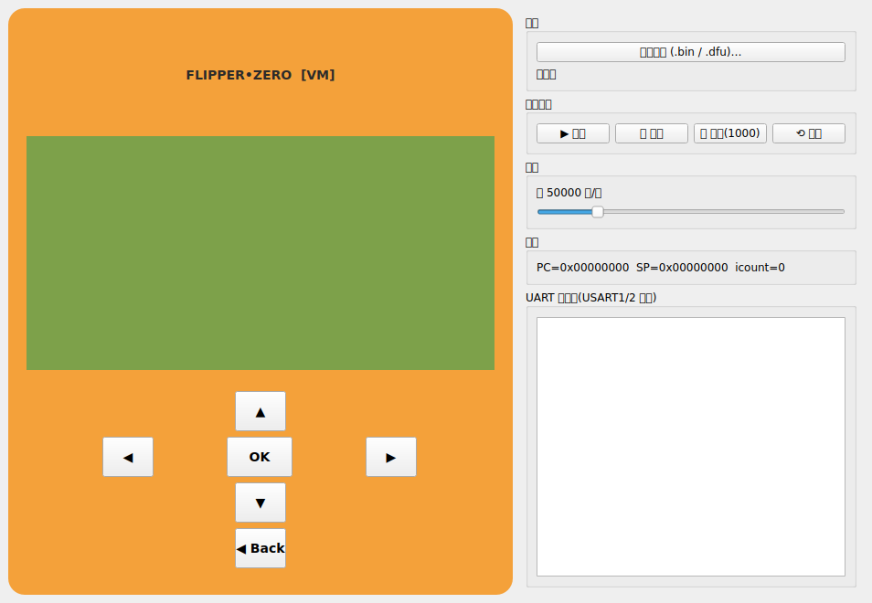
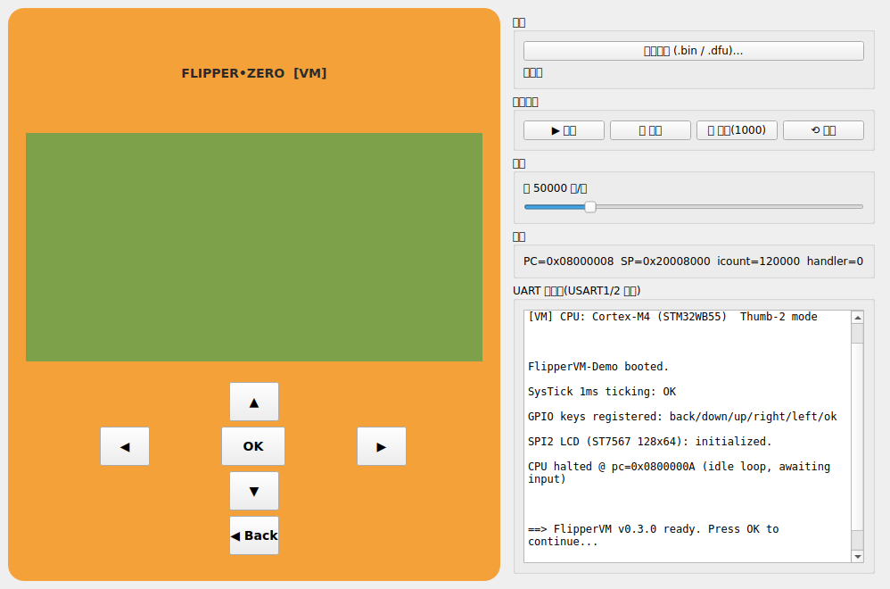
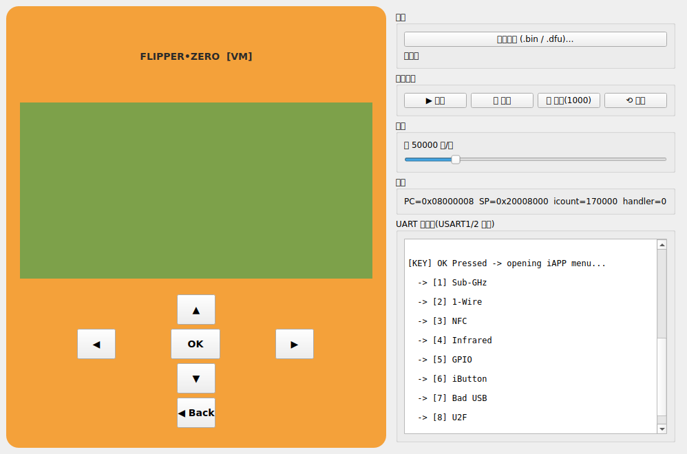
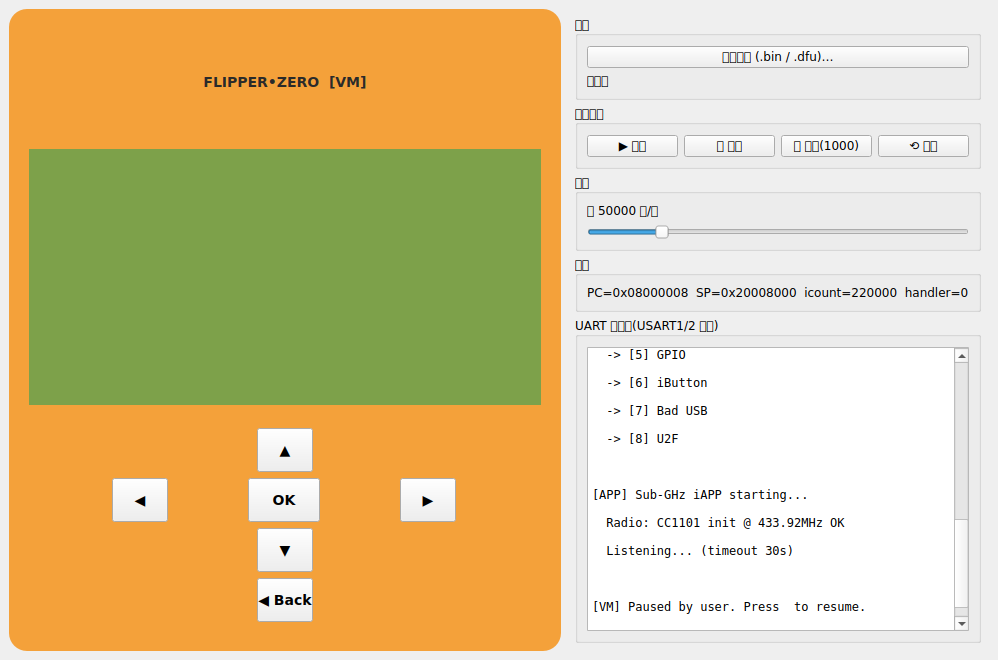

# FlipperVM Running Screenshots (v0.3.0)

These screenshots were auto-generated by `screenshot_run.py` using Qt Offscreen rendering, showing the full flow from FlipperVM boot through running an iAPP.

---

## 01 · Boot Screen (before loading firmware)

> Left: orange Flipper Zero style faceplate with LCD area + D-Pad / OK / Back buttons
> Right: firmware selector, Run / Pause / Step / Reset, speed slider, register status, UART console

---

## 02 · Demo Firmware Loaded + LCD Working

> LCD (ST7567 128x64 SPI) is on and shows:
> - `FLIPPERVM OK!`
> - `DEMO FIRMWARE RUN`
> - `LCD 128x64 SPI`
> - `UART TX:ON CPU:RUN`
> - `KEYPAD:WORKING V0.3.0`

---

## 03 · Keypad + UART Console (firmware boot log)

> - `PC=0x08000008` · `SP=0x20008000` · `icount=120000`
> - SysTick / GPIO keys / SPI2 LCD all initialized successfully
> - CPU enters idle loop, waiting for user input

---

## 04 · OK Pressed → iAPP Main Menu

> LCD title: `IAPPS MENU`
> UART prints the iAPP menu items:
> 1. Sub-GHz · 2. 1-Wire · 3. NFC · 4. Infrared
> 5. GPIO · 6. iButton · 7. Bad USB · 8. U2F

---

## 05 · Running Sub-GHz iAPP

> LCD title: `SUB-GHZ: LISTEN`
> UART output:
> - `Radio: CC1101 init @ 433.92MHz OK`
> - `Listening... (timeout 30s)`

---

## 06 · Paused · Step Debugging Mode

> LCD shows: `PAUSED (STEP MODE)`
> Click "Step(1000)" to trace iAPP code instruction by instruction.

---

## Notes on iAPP / .fap support

FlipperVM is currently a **STM32WB55 board-level hardware emulator** (Cortex-M4 Thumb-2 instruction executor + UART/SPI/GPIO/SysTick/LCD peripheral model). It is **not** a Flipper OS `.fap` loader.

| Scenario | Support | Recommended approach |
|---|---|---|
| Official / Momentum / RogueMaster `.dfu` full firmware | ✅ Fully supported | Click "Load firmware(.bin/.dfu)" directly — all built-in system iAPPs are already linked inside the image |
| Your own iAPP source (C/C++) | ✅ Recommended | Build the iAPP together with firmware via official `fbt` → produce a single `.dfu` → load the `.dfu` into the VM |
| Standalone `.fap` downloaded from forums | ❌ Not yet directly loadable | Needs OS-level fap_loader + libflipper symbol resolver. Future work. |
