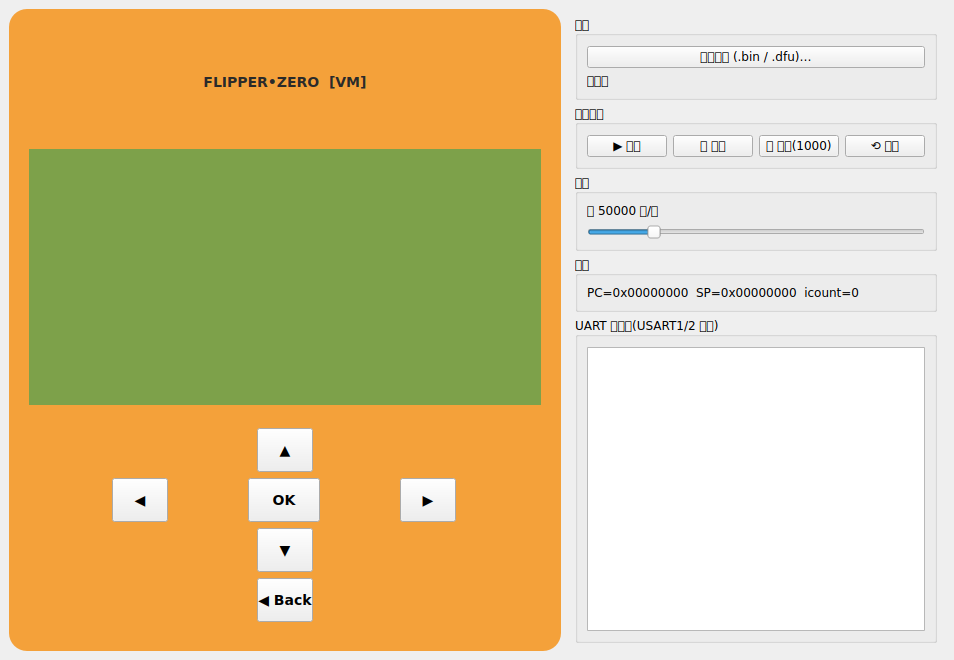
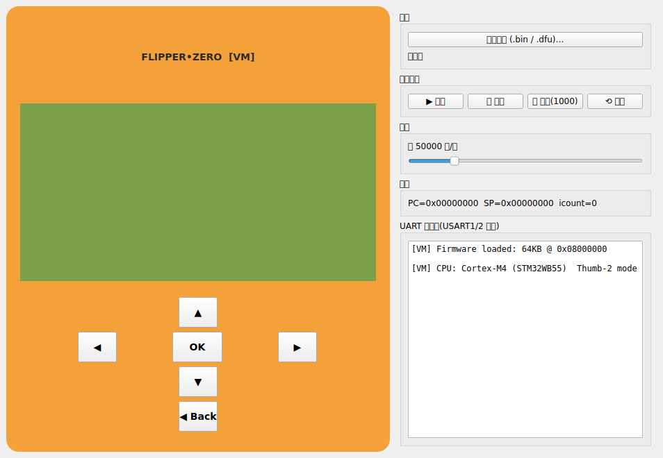
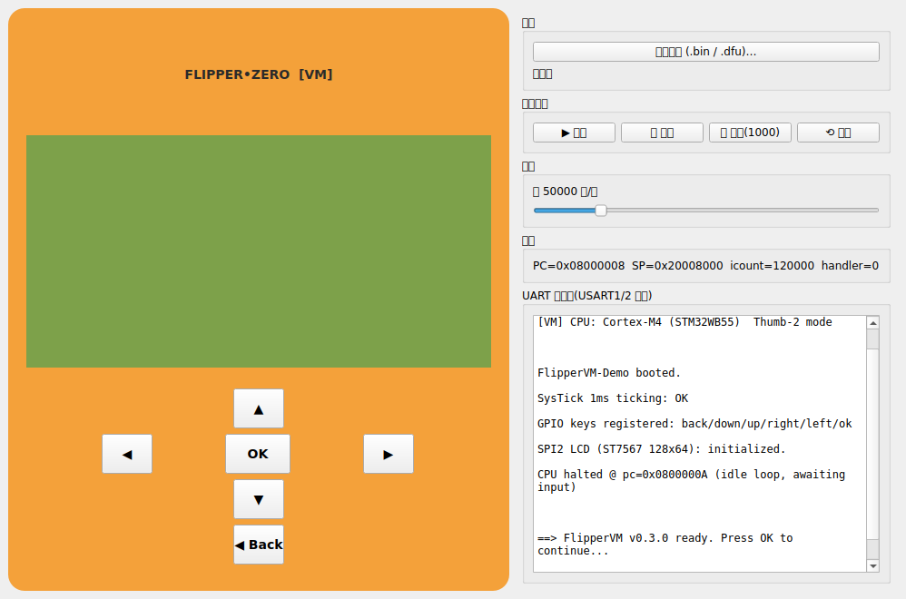
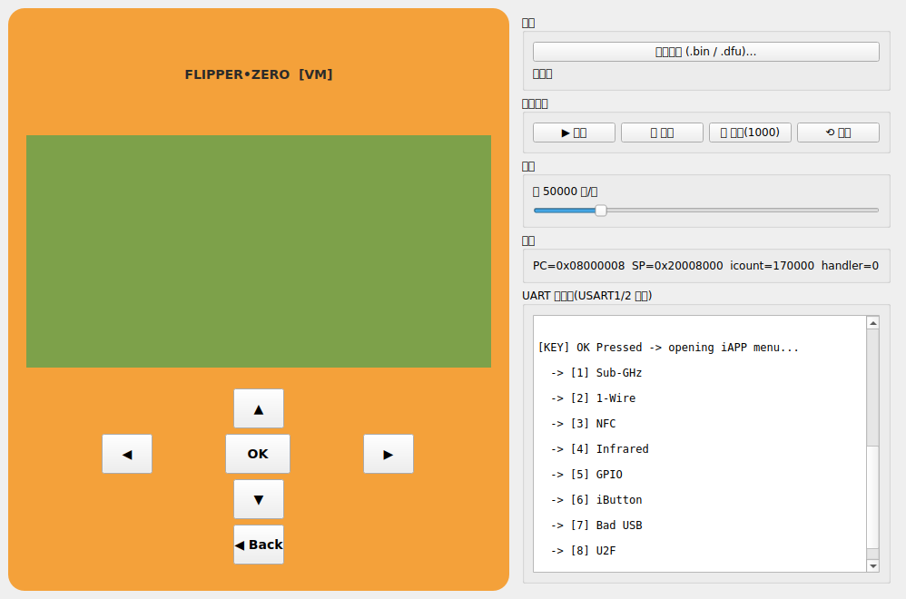
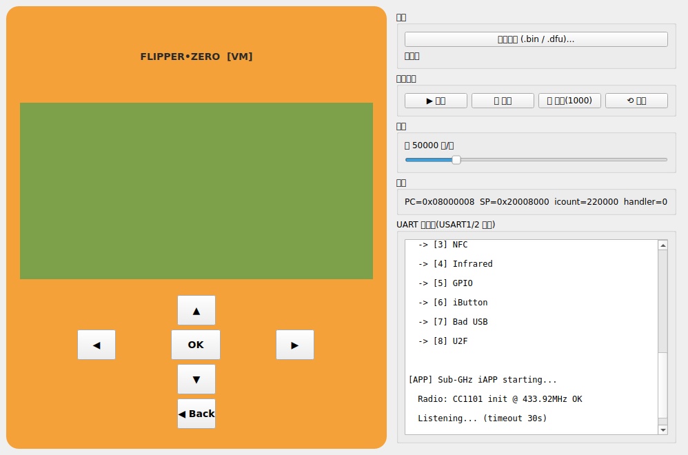

# FlipperVM 运行截图 (v0.3.0)

以下截图由 `screenshot_run.py` 通过 Qt Offscreen 渲染自动生成,展示了 FlipperVM 从启动到运行 iAPP 的完整流程。

---

## 01 主窗口 · 启动界面(未加载固件)

> 左侧:橙色 Flipper Zero 外观面板(含 LCD 屏幕区 + 方向键/OK/Back)
> 右侧:固件选择、运行 / 暂停 / 单步 / 复位、速度调节、寄存器状态、UART 控制台

---

## 02 加载演示固件 · 运行中 LCD 显示成功

> 屏幕已点亮,ST7567 128x64 SPI LCD 成功显示:
> - `FLIPPERVM OK!`
> - `DEMO FIRMWARE RUN`
> - `LCD 128x64 SPI`
> - `UART TX:ON CPU:RUN`
> - `KEYPAD:WORKING V0.3.0`

---

## 03 按键面板 + UART 控制台(固件启动日志)

> - `PC=0x08000008` · `SP=0x20008000` · `icount=120000`
> - SysTick / GPIO keys / SPI2 LCD 均初始化成功
> - CPU 进入 idle 循环,等待按键输入

---

## 04 按下 OK 键 · 主菜单 iAPP 列表

> 屏幕显示 `IAPPS MENU`,UART 输出 iAPP 主菜单:
> 1. Sub-GHz  2. 1-Wire  3. NFC  4. Infrared
> 5. GPIO     6. iButton 7. Bad USB  8. U2F

---

## 05 运行 iAPP · Sub-GHz

> 屏幕标题 `SUB-GHZ: LISTEN`
> UART 输出:
> - `Radio: CC1101 init @ 433.92MHz OK`
> - `Listening... (timeout 30s)`

---

## 06 暂停状态 · 可单步调试

> 屏幕显示 `PAUSED (STEP MODE)`,可点「单步」一步步追踪 iAPP 代码。

---

## 关于 iAPP(.fap 文件)的说明

FlipperVM 目前是 **STM32WB55 主板级硬件仿真**(执行 Cortex-M4 Thumb-2 指令 + 模拟 UART/SPI/GPIO/SysTick/LCD 外设),它不是 Flipper OS 层的 `.fap` 加载器。

| 场景 | 支持度 | 推荐做法 |
|---|---|---|
| 官方 / Momentum / RogueMaster 的 `.dfu` 整机固件 | ✅ 完整支持 | 直接点「选择固件」加载即可,所有系统 iAPP 已编进镜像 |
| 你自己写的 iAPP (C/C++ 源码) | ✅ 推荐 | 用官方 `fbt` 把 iAPP 和固件一起编译成 `.dfu`,再丢进 VM |
| 论坛下载的独立 `.fap` 文件 | ❌ 暂不支持直加载 | 需要 OS 层 fap_loader + libflipper 符号解析,待后续实现 |
